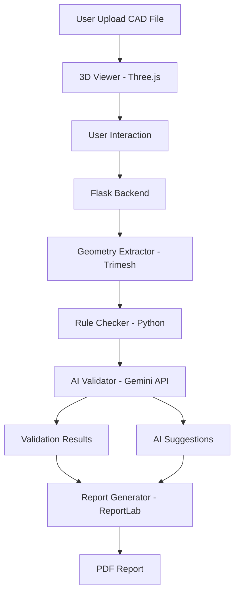

# CAD Validator - AI-Driven Design Intelligence

[](https://python.org)
[](https://flask.palletsprojects.com)
[](https://threejs.org)
[](LICENSE)

---

## Problem Statement

In manufacturing workflows, design validation and rework consume **15–20% of product development time**. Engineers manually inspect CAD models for issues like wall thickness, watertightness, and manufacturability constraints.

**CAD Validator** automates this process using AI-driven validation and rule-based analysis.

---

## Features

### 3D Model Viewer
- Interactive STL/OBJ viewer using Three.js  
- Orbit controls (rotate, pan, zoom)  
- Visual highlighting based on compliance  

### AI-Powered Validation
- Part type detection (bracket, housing, etc.)  
- Context-aware validation rules  
- Intelligent fix recommendations  
- Natural language Q&A interface  

### Rule-Based Checks
- Wall thickness validation  
- Watertight / manifold detection  
- Sharp edge detection  
- Hole diameter validation  
- Symmetry analysis  
- Surface-to-volume ratio  

### Reports
- PDF report generation  
- Compliance scoring  
- Severity-based violation listing  
- AI-generated explanations  

---

## System Architecture



---

## Quick Start

### Prerequisites

- Python 3.10+
- pip

---

## Installation

```bash
git clone https://github.com/yourusername/cad-validator.git
cd cad-validator

python -m venv venv
source venv/bin/activate  # Windows: venv\Scripts\activate

pip install -r requirements.txt
```

---

## API Setup

Create a `.env` file:

```
GEMINI_API_KEY=your_api_key_here
```

---

## Run Application

```bash
python app.py
```

Open:
```
http://localhost:5000
```

---

## Usage

1. Upload STL/OBJ file  
2. Inspect model in 3D viewer  
3. Run validation  
4. Review violations  
5. Ask AI questions  
6. Download report  

---

## Tech Stack

| Component | Technology |
|----------|-----------|
| Backend | Flask |
| AI | Google Gemini API |
| 3D Viewer | Three.js |
| Geometry Processing | Trimesh, NumPy |
| PDF | ReportLab |
| Frontend | HTML, CSS, JavaScript |

---

## Project Structure

```
cad-validator/
│
├── app.py
├── requirements.txt
├── .env
│
├── frontend/
│   └── templates/
│       └── index.html
│
├── backend/
│   └── modules/
│       ├── geometry_extractor.py
│       ├── rule_checker.py
│       ├── ai_validator.py
│       └── report_generator.py
│
├── uploads/
└── reports/
```

---

## Validation Rules

| Rule | Severity | Description |
|-----|--------|------------|
| Watertight | CRITICAL | No open edges |
| Wall Thickness | CRITICAL | ≥ 1.5mm |
| Sharp Edges | WARNING | Needs fillets |
| Symmetry | INFO | Check design intent |
| Hole Diameter | CRITICAL | ≥ 1.0mm |

---

## Testing

```bash
python test_gemini.py

python -c "from backend.modules.geometry_extractor import extract_geometry; print(extract_geometry('sample.stl'))"
```

---

## Sample Output

```
Compliance Score: 85/100
Part Type: Housing
Manufacturability: ACCEPTABLE

Violations:
CRITICAL: Model not watertight
Fix: Use mesh repair tools
```

---

## Future Improvements

- Support more CAD formats (STEP, IGES)  
- Real-time validation feedback  
- Cloud deployment  
- Advanced simulation checks  
- Collaborative design review  

---

## License

MIT License

---

## Acknowledgments

- Google Gemini API  
- Three.js  
- Trimesh  

---

## 📧 Contact

GitHub: https://github.com/yourusername/cad-validator

---

⭐ Star this repo if useful
